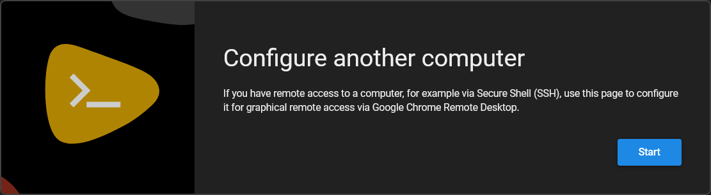
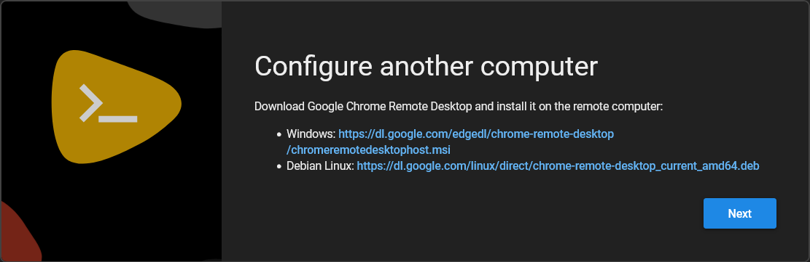
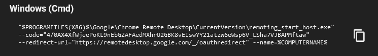
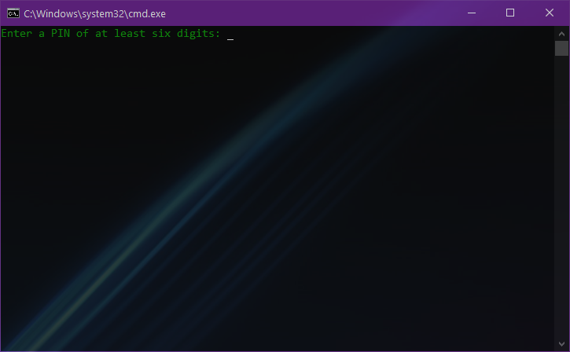

# CumRD
A script to Auto-Configure Chrome RD on Windows 10
# Keys Setup
Go to the CRD page [here](https://remotedesktop.google.com/headless)
#### Click on start

#### Press the next button

Now, click on Authorize & copy your Windows (CMD) keys

#### Keys .txt
Start with @echo off and paste what you copied earlier (Windows CMD Keys)
**The key.txt file must ALWAYS be in the same directory as the CumRD, and NEVER give it a different name.**
```
@echo off
:: Your key here
```
# Note:
If you have encountered an error while setting the PIN after installation, restart the computer, press Windows Key + R and type "crdconf", a message for setting the PIN will open.

